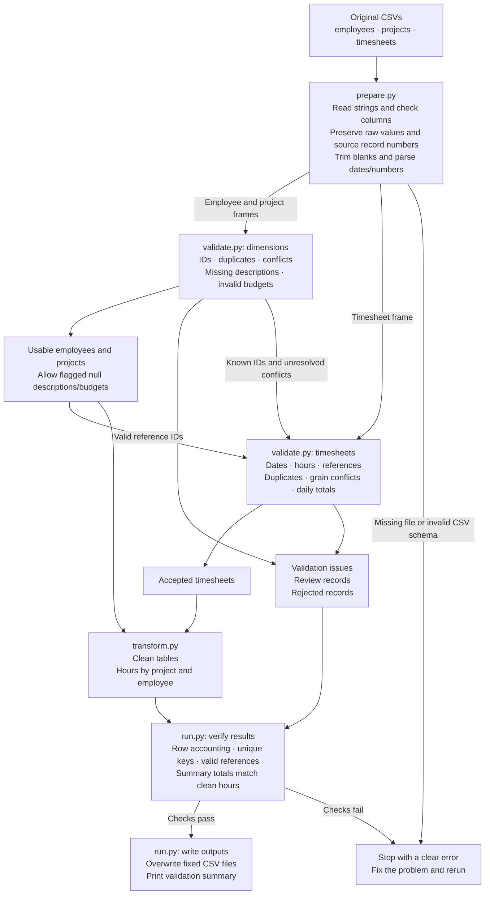
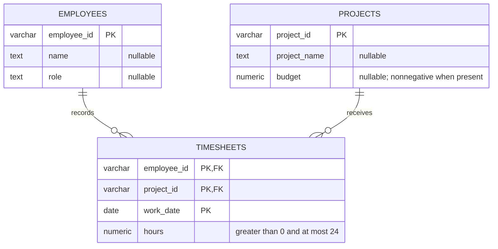

# Assessment pipeline

Flow of the small Python/pandas implementation. See [architecture.md](architecture.md) for rules and module responsibilities.

Raw input files stay unchanged. Repeated successful runs rebuild and overwrite the same outputs rather than append data. An interrupted export requires a rerun; atomic publication is outside this assessment's scope.

Review records need a source correction or an explicit business decision. Unique, valid dimension IDs with incomplete descriptive fields or uncertain budgets remain usable with null attributes and reported issues. Conflicting dimensions and all timesheet review records are excluded from clean outputs. Only accepted timesheet hours enter summaries.

# Proposed relational model

Each timesheet belongs to exactly one employee and one project; an employee or project can have zero timesheets. The three `PK` fields in `TIMESHEETS` form a single composite key, assuming one entry per employee/project/day. If multiple entries are legitimate, use a stable source entry ID instead.

The ER diagram describes the proposed clean schema. Review/rejected records and validation issues are separate CSV audit outputs. The assessment delivers schema definitions; operating a database is not required.
